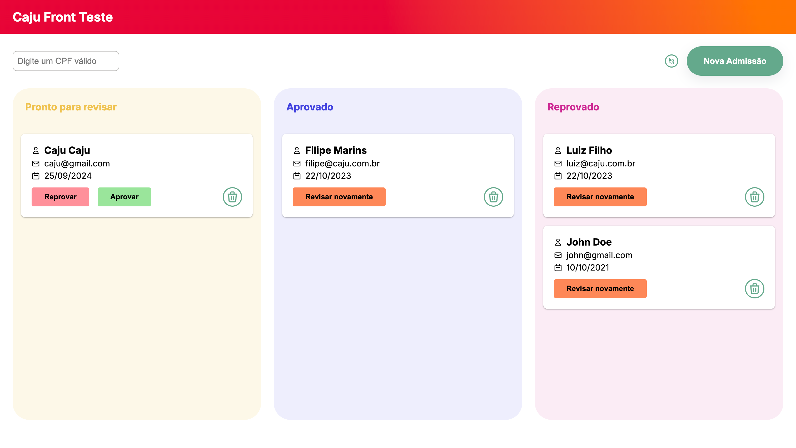
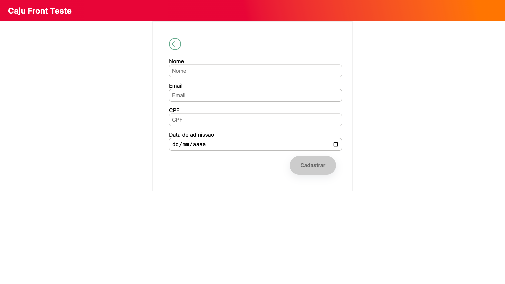
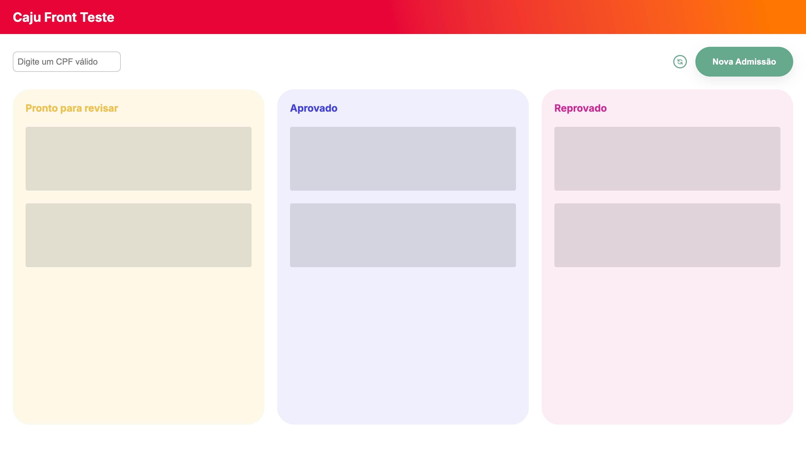

## About
**App available on https://cajutest.netlify.app/**

**JSON server available on https://boiled-aluminum-circle.glitch.me/registrations**

This project makes use of the following technologies:

- **Typescript**;
- **Axios** and **React Query** for fetching data;
- **Jest** and **RTL** for unit testing;
- **Cypress** for e2e testing;
- **MaterialUI** for some components UI styling.

## Application

**Features:**
- Registration list categorized by status;
- Refresh functionality;
- CPF search with CPF validation;
- Update registration status (Approve, Reject, or Review) with a confirmation modal;
- Add new registration with field validation (CPF, name, email);
- User feedback for all actions (success or error) displayed via a top-center snackbar

**Screenshots:**

**Gifs:**

